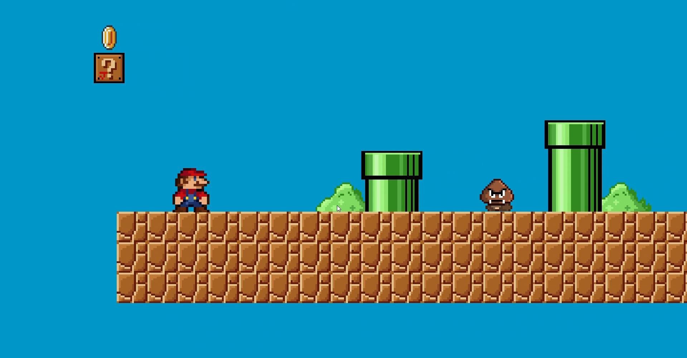
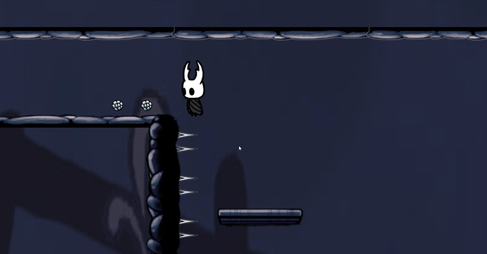
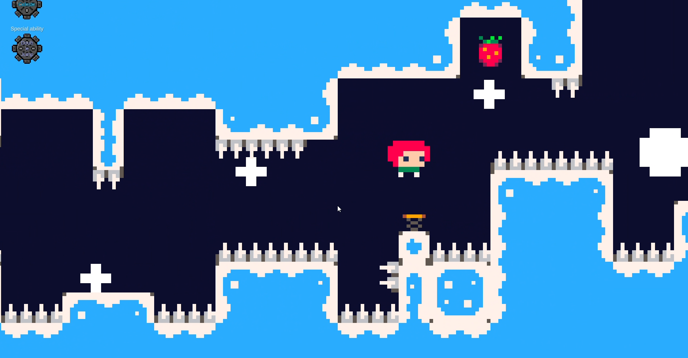
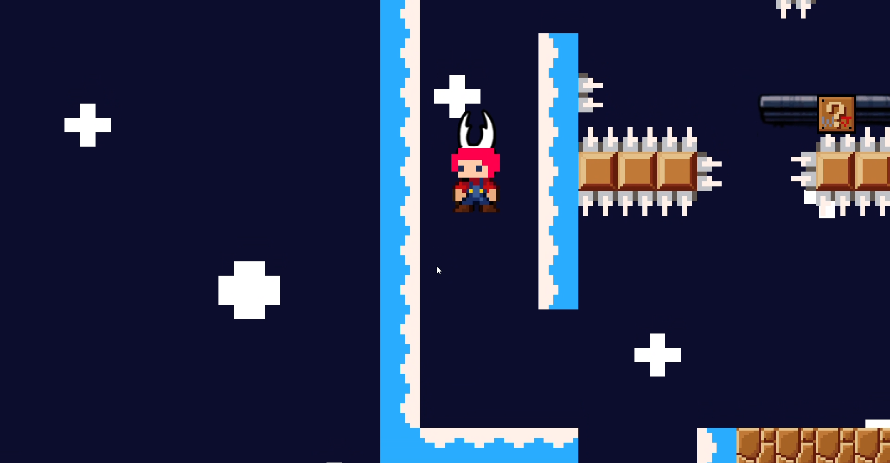
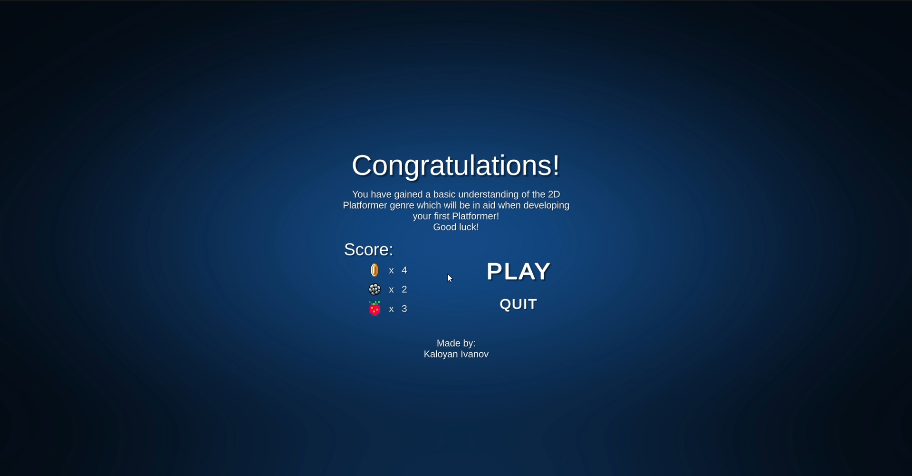

# Platvolution

A project I chose to work on for my Game Design assignment, developed in Unity 2D.

## Overview
The game presents the evolution of 2D Platformers by observing three games – Super Mario Bros, Hollow Knight and Celeste.
The Player starts as a beginner game designer, with a very basic set of abilities and as he progresses through it, he collects abilities that are characteristic for the currently observed game.

   
   
   
   
   
   

## Mechanics

- Changing Movement feel
- Changing Special ability
- Jump
- Double-jump
- Dash
- Wall-jump

## Art

Hollow knight assets - https://www.reddit.com/r/HollowKnight/comments/cf83u1/all_hollow_knight_sprites_as_of_version_1432/
https://drive.google.com/drive/folders/1lx02_w9TFTYdR3aggI1gbXcLr69roaNV?usp=sharing 
Celeste assets -
https://gamebanana.com/tools/13614 
Cog wheels -
https://opengameart.org/content/cogwheels-and-gears 
Portals -
https://opengameart.org/content/portals-32-x-48
